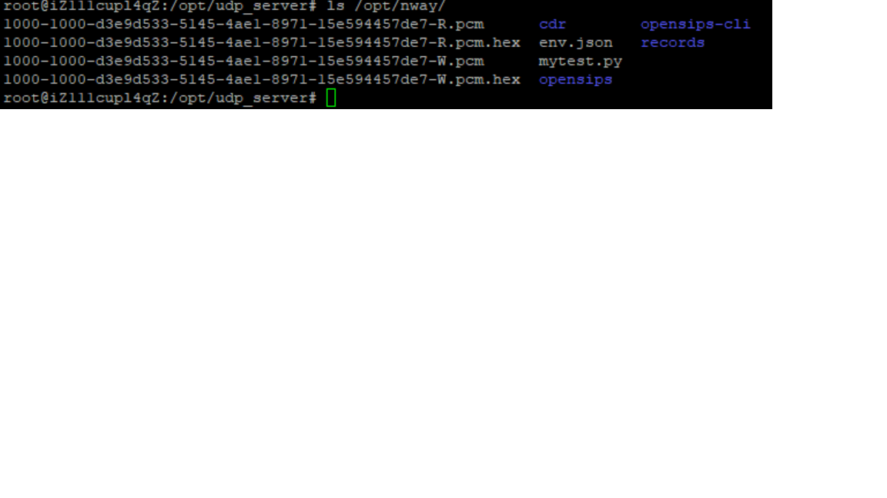
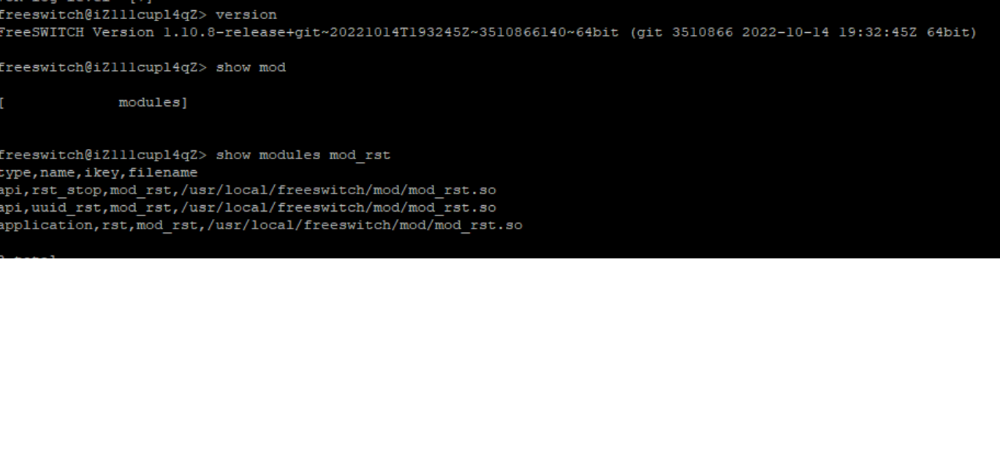

# rst

A real time stream trans to other application or server for FreeSWITCH

## mod_rst

get media bug data send it to an udp server

## udp_server

receive udp packet and write into file

# 中文说明

实时将FreeSWITCH通话中的语音媒体流导出到其它程序或机器中
支持双路音频实时数据通过udp 传输给其它的udp server，从而进行识别或旁路录音等

## mod_rst

实时对 media bug 数据转发的模块

## udp server
接收udp包并写进文件中

## NOTICE

由于很多人说不能用，所以试了一下，开发是在freeswitch 1.10.8下开发，二进制包也是在1.10.8下打的，如图

## 协议
//理论上，不需要回应包，但收到包后回一个

//ACK :478525a8-8263-4550-b18c-d027d11c9865

//如果是数据则格式如下：

//DATA:UUID:FLAG:PAYLOAD:LENGTH:xxx

//如  DATA:478525a8-8263-4550-b18c-d027d11c9865:R:00:160:xxxxx

//uuid为FS的session_id

//FALG为FS在channel中的read/write,用R或W

//payload为编码，如00,pcmu,08 PCMA,18 G729 ,04 G723, 10 PCM

//每次收到包后，需要更新下时间，如果某条通道不论read write长时间没有包过来，则我们需要自行BYE

//如果是开始需要送udp包，则发：

//INV :UUID:CALLER:CALLEE

//如：

// INV :478525a8-8263-4550-b18c-d027d11c9865:18621575908:02131570530

//如果是挂机则发：

//BYE :UUID

//如

// BYE :478525a8-8263-4550-b18c-d027d11c9865

## License:GPL

## 安装使用：

1. 将 rst.conf.xml 拷贝到`/usr/local/freeswitch/conf/autoload_configs/rst.conf.xml`

2. mod_rst.so 拷贝到`/usr/local/freeswitch/mod/mod_rst.so`

3. 通这 fs_cli 中 `load mod_rst` 如无异常可以正常加载

4. 后台启动 udp_server

5. 在 freeswitch 的 dialplan 中配置路由

`<action application="set" data="execute_on_answer='rst serverip serverport'"/>`
如果是 fs 1.10.10 版本，要去掉单引号，否则总提示找不到application
`<action application="set" data="execute_on_answer=rst serverip serverport"/>`
如不指定 serverip、serverport 那么自动使用默认的 ip/port。

6. 如果是 esl 连接，那么在 inbound 模式下中调用时使用 `uuid_rst uuid serverip serverport`即可

7. 如果是要将`<param name="write-hex" value="true"/>` 配为 true,那么需要先创建一个`mkdir /opt/nway/records/ -p`
